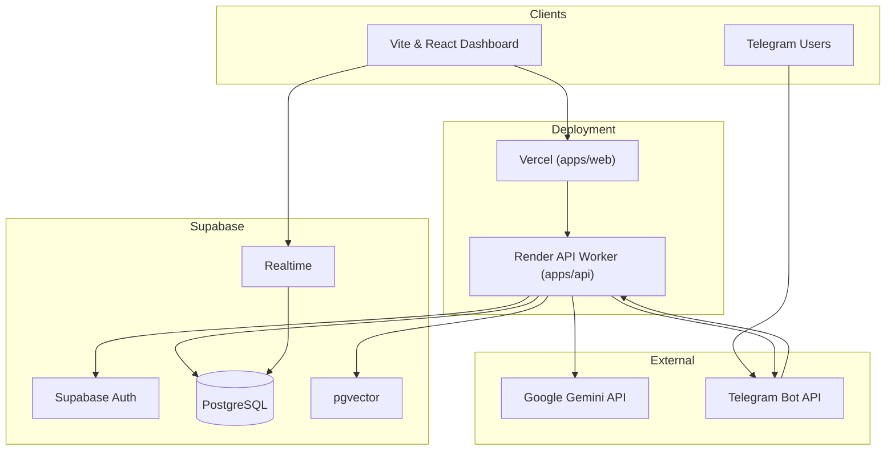

# Architecture

High-level system design for Phase 1 of Murmur.

## System Diagram

---

## Technical Stack & Libraries

We prioritize using established libraries to reduce custom boilerplate.

### Core Stack
- **Workspace Manager:** `pnpm workspaces` (fast, disk-efficient, strict isolation)
- **Build Orchestration:** `Turborepo` (parallel dev/build, task-caching)
- **Language:** `TypeScript 5.x` (strict mode across monorepo)
- **Lint/Format:** `ESLint` + `Prettier` (strict TypeScript guidelines)

### Frontend (apps/web)
- **Bundler:** `Vite 6`
- **Framework:** `React 19`
- **Styling:** `Tailwind CSS 4`
- **UI Components:** `shadcn/ui` (built on Radix Primitives)
- **Icons:** `lucide-react`
- **Routing:** `React Router 7` (SPA routing)
- **State Management:**
  - Server State: `TanStack Query v5` (caching, retries, queries)
  - Client UI State: `Zustand` (minimal, sidebar/filter UI settings)
  - Session State: `@supabase/supabase-js`
- **Forms:** `react-hook-form` + `@hookform/resolvers/zod`
- **Charts:** `Recharts` (progress analytics)
- **Toasts:** `sonner`

### Backend (apps/api)
- **Runtime:** `Node.js 22 LTS`
- **Framework:** `Express 5` (native async router support)
- **Telegram Bot Framework:** `Grammy` (TypeScript-first middleware, webhook execution)
- **Database Access:** `Drizzle ORM` + `postgres.js` driver
- **Authentication Validator:** `@supabase/supabase-js` (service role)
- **Scheduling:** `node-cron`
- **Timezones:** `date-fns-tz` (user-local cron windows)
- **Logging:** `pino` + `pino-pretty` (dev logs)
- **Security:** `helmet`, `cors`, `express-rate-limit`

### Cross-App Shared (packages/shared)
- **Validation:** `Zod` (API payloads, env variables, AI structured outputs)
- **Prompts:** Prompts templates and metadata

---

## Monorepo Layout

| Package | Deploy Target | Responsibility |
|---------|---------------|----------------|
| `apps/web` | **Vercel** | Dashboard, user registration/login, settings, insights, Supabase Realtime subscriptions |
| `apps/api` | **Render (Web Service)** | Persistent Express server running Grammy Webhook and node-cron jobs |
| `packages/shared` | — (Internal NPM) | Shared Zod schemas, TypeScript interfaces, prompt templates, env parser |

---

## Deployment & Hosting

### Render for API Worker (Persistent)
Why Render instead of Vercel for the backend?
1. **Telegram Webhooks:** Webhook responders require quick execution without serverless warm-up latency.
2. **Cron Scheduler:** `node-cron` runs in-process hourly loop checking user timezone execution windows. Serverless functions cannot support long-running, in-memory cron schedulers and will time out.

### Vercel for Web Frontend (Static SPA)
Vercel hosts the React SPA statically, distributing assets globally for instant loading.

---

## Environment Variables

All env variables are verified at application startup using Zod schemas defined in [env.ts](file:///e:/Projects/tasks/Murmur/packages/shared/src/env.ts).

### Backend / API Secrets (apps/api)
| Variable | Validation | Purpose |
|----------|------------|---------|
| `SUPABASE_URL` | Zod URL | Base endpoint for the Supabase project |
| `SUPABASE_SERVICE_ROLE_KEY` | Zod string | Service role key. **NEVER** expose to the client. Bypasses RLS to write system entries |
| `GEMINI_API_KEY` | Zod string | Google AI API authentication key |
| `TELEGRAM_BOT_TOKEN` | Zod string | Token provided by Telegram BotFather |
| `TELEGRAM_WEBHOOK_SECRET` | Zod string | Header token verified on incoming webhooks to ensure requests come from Telegram |
| `JWT_LINK_SECRET` | Zod string (min 16) | Secret key to sign linking tokens for deep links |
| `API_URL` | Zod URL | Base URL of the API gateway |
| `WEB_URL` | Zod URL | Base URL of the client dashboard |
| `PORT` | Zod number | Port to bind the Express application (default: 3001) |
| `NODE_ENV` | Zod enum | `development`, `production`, or `test` |

### Frontend Variables (apps/web)
| Variable | Validation | Purpose |
|----------|------------|---------|
| `VITE_SUPABASE_URL` | Zod URL | Supabase endpoint for client auth & Realtime |
| `VITE_SUPABASE_ANON_KEY` | Zod string | Client-safe API key for database access governed by RLS |
| `VITE_API_URL` | Zod URL | Target Express API server |

---

## Data Flow Patterns

### 1. Telegram Message Loop (Inbound)
1. User sends message to Telegram Bot.
2. Telegram Bot API hits `POST /webhooks/telegram` in `apps/api`.
3. Check header verification secret and dedup via `webhook_events.update_id`.
4. Fetch user profile and preferences from database.
5. Retrieve 4-layer AI memory context (rolling summary, user facts, semantic search via `pgvector` on past embeddings).
6. Send context to Gemini API → retrieve generated response.
7. Send generated message back to user via Grammy `ctx.reply()`.
8. Write message payload to `messages` table (triggers Supabase Realtime update for dashboard UI).

### 2. Hybrid Dashboard Read/Write Pattern
- **Reads (Direct Supabase):** Web app connects to Supabase client using RLS policies. It reads `messages` (via Realtime client), `weekly_summaries`, and `daily_actions`. This bypasses Express API server for faster read latency.
- **Writes (API Gateway):** Creating links, editing timezone preferences, and custom operations request authentication tokens from Supabase Auth and execute via `POST / PATCH` requests to `apps/api` using Bearer JWT authorization.

---

## Related Docs
- [[Folder Structure]]
- [[Database]]
- [[APIs]]
- [[Authentication]]
- [[Scheduling]]
- [[AI and Memory]]
- [[Telegram Integration]]
