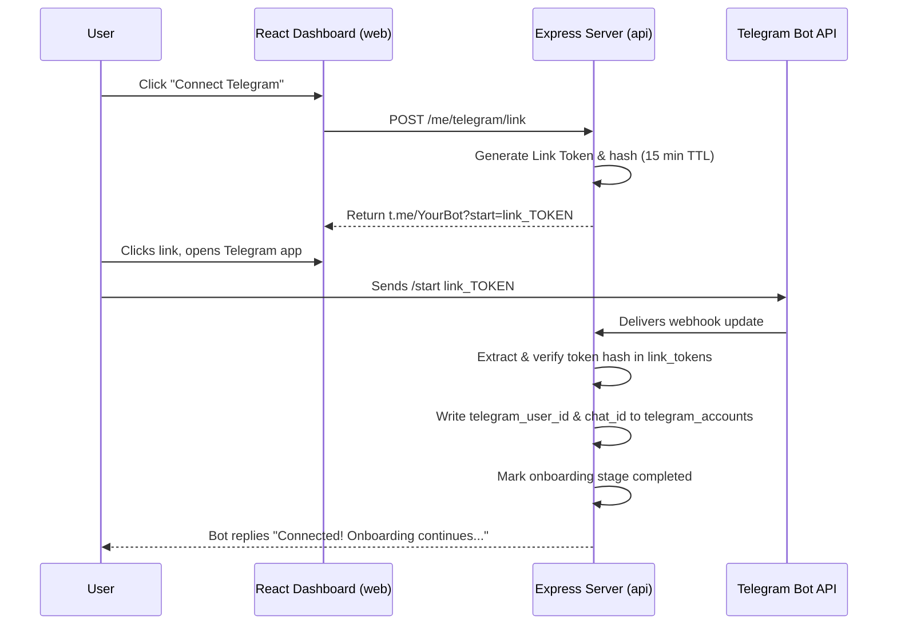

# Telegram Integration

Murmur's primary interactive channel is **Telegram**, run via the **Grammy** bot framework. It provides low-friction conversation capabilities and prompts.

---

## Telegram Account Linking Flow

To bind a web application user to a Telegram chat safely, we use short-lived, signed linking tokens rather than exposing raw database IDs in URLs.



---

## Message Ingestion & Processing Loop

### 1. Inbound Hook
1. Telegram Bot API sends update payload via `POST /webhooks/telegram`.
2. **Idempotency Guard:** Verify if `update_id` exists in the `webhook_events` table. If it exists, discard immediately to prevent double processing.
3. Save the `update_id` in `webhook_events`.
4. Extract sender's `telegram_user_id`. Query `telegram_accounts` to find the associated `userId`.
5. If the account is linked:
   - Save the user's message to the `messages` table.
   - Fetch the 4-layer context (history, memory key-values, rolling summary, semantic recall) via the AI Service.
   - Request Gemini `gemini-2.0-flash` to construct a response.
   - Save the AI response to the `messages` table (which triggers a dashboard refresh via Supabase Realtime).
   - Deliver reply to the user via Grammy `ctx.reply()`.

### 2. Outbound Cron Messages
The scheduler triggers outbound alerts directly:
1. Hourly cron checks database for users matching preferred alert times.
2. Read the user's saved `chatId` from `telegram_accounts`.
3. Call the Grammy instance `bot.api.sendMessage(chatId, text)` to push the notification.

---

## Local Development Modes

We support two modes of operation for local testing:

### Option A: Polling Mode (Recommended for simple testing)
- Grammy bot runs locally in polling mode: `bot.start()`.
- No webhook setup or tunnel needed.
- Cannot process standard HTTP webhooks simultaneously; runs strictly inside development process loops.

### Option B: Webhook Mode (For production parity)
- Run an `ngrok` tunnel pointing to the local port:
  ```bash
  ngrok http 3001
  ```
- Set `TELEGRAM_WEBHOOK_URL` in env variables to the ngrok address (e.g. `https://xxxx.ngrok-free.app/webhooks/telegram`).
- The Express app registers the webhook on boot using the Grammy client `bot.api.setWebhook()`.

---

## Security

1. **Webhook Header Validation:** The bot registers a unique secret token string using `TELEGRAM_WEBHOOK_SECRET`. When handling incoming updates, the Express server verifies that the header `X-Telegram-Bot-Api-Secret-Token` matches this secret token exactly.
2. **Short-Lived Link Tokens:** Link tokens expire in 15 minutes and can only be used once. Token hashes are stored in the database, and raw tokens are verified using cryptographic SHA-256 matching.

---

## Related Docs
- [[Authentication]]
- [[APIs]]
- [[Database]]
- [[AI and Memory]]
- [[Scheduling]]
